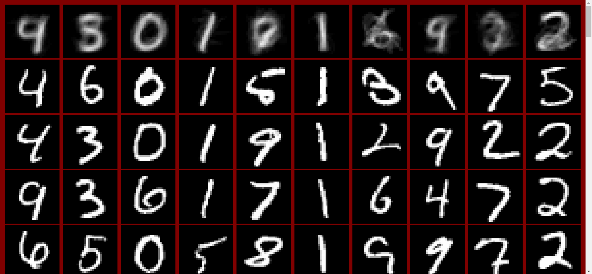

# **K-means Clustering on MNIST Dataset Using MPI**

Modification of sequential k-means clustering to run in parallel using MPI. The k-means clustering algorithm is executed on the original MNIST handwritten digits dataset.

## **Author**

Justin Thoreson

## **Programs**

There are two main executables: 
* `MNISTKMeansSequential` - Sequential k-means clustering for MNIST images
* `MNISTKMeansParallel` - Parallel k-means clustering for MNIST images

## **Build**

To compile and link all executables, run:
```
make
```

To build a program individually, run:
```
make [PROGRAM]
```

## **Execution**

To build and execute `MNISTKMeansSequential`, run:
```
make mnistseq
```

To build and execute `MNISTKMeansParallel`, run:
```
make mnist#
```
where `#` is the number of parallel processes to execute (e.g., `make mnist32`).

## **MNIST K-means Clustering**

Each MNIST image is 28x28 = 784 pixels in size; thus, the dimensionality of an MNIST image is 784. Each pixel is greyscale and represented by an unsigned byte with a value range of 0 to 255. An MNIST image is clustered based on the collective euclidean distance of all of its pixel values. The data set for the MNIST images are contained in the file `t10k-images-idx3-ubyte` and the corresponding labels are contained in `t10k-labels-idx1-ubyte`.

Given the large data set, `MNISTKMeansSequential` is configured to cluster only the first 1000 images of the MNIST data set, while `MNISTKMeansParallel` is configured to cluster only the first 250 images.

Since the MNIST data set is comprised of handwritten digits, ten possible values ranging from 0 to 9, it is fitting that k-means runs with ten clusters.

## **Results**

Clustering for both `MNISTKMeansSequential` and `MNISTKMeansParallel` is reported to the console where the labels of each image are printed with their respective clusters. 

Visualizations of both programs are output to HTML files named `kmeans_mnist_seq.html` and `kmeans_mnist_mpi.html` respectively. The top row of a visualization shows the derived clusters, while the images underneath each cluster are images from the MNIST data set that have fallen within their rkmeans_mnist_mpi.htmlespective cluster above.

## **Example**

While executing `MNISTKMeansParallel` with 250 images, 32 processes, and 10 clusters, the results may appear as follows:



## **Files**

* `KMeans.h` - Sequential k-means class
* `KMeansMPI.h` - Parallel k-means class utilizing MPI
* `MNISTImage.h` - MNIST image wrapper class declaration
* `MNISTImage.cpp` - MNIST image wrapper class implementation
* `MNISTKMeans.h` - Sequential k-means class for MNIST images
* `MNISTKMeansMPI.h` - Parallel k-means class for MNIST images using MPI
* `MNISTKMeansParallel.cpp` - Runs parallel k-means on MNIST images using MPI
* `MNISTKMeansSequential.cpp` - Runs sequential k-means on MNIST images
* `t10k-images-idx3-ubyte` - MNIST images data set
* `t10k-labels-idx1-ubyte` - MNIST labels data set
* `valgrind.supp` - Valgrind error suppressions
* `Makefile` - Builds all executables

## **References**

* [Original MNIST dataset](http://yann.lecun.com/exdb/mnist/)
* [EMNIST dataset](https://www.nist.gov/itl/products-and-services/emnist-dataset)
* Cohen, G., Afshar, S., Tapson, J., & van Schaik, A. (2017). EMNIST: an extension of MNIST to handwritten letters. Retrieved from http://arxiv.org/abs/1702.05373
